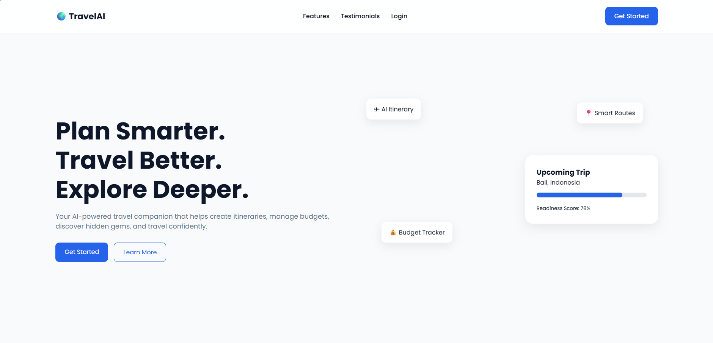
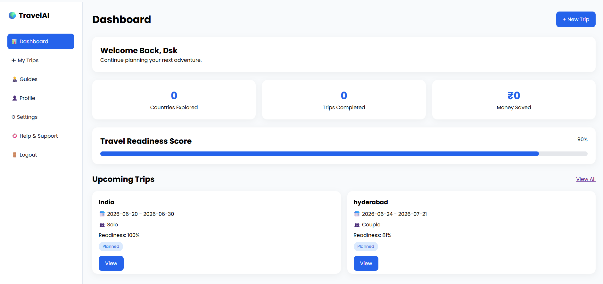
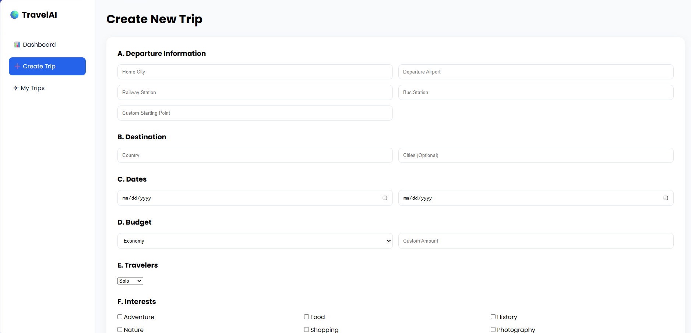

# Intelligent Travel Itinerary Creator
An AI-powered travel companion website that helps users plan trips,
generate itineraries, discover hidden gems, manage budgets,
connect with local guides, and access travel survival information.
## Features

- User Authentication
- AI Trip Generation
- My Trips Dashboard
- Hidden Gem Recommendations
- Local Guide Marketplace
- Travel Survival Kit
- Travel Readiness Score
- Budget Tracking
- Document Storage
- Responsive Design
## Tech Stack

- HTML
- CSS
- JavaScript
- LocalStorage

# Screenshots

## Landing Page

## Dashboard

## Create Trip

## Run Locally

1. Clone repository

git clone ...

2. Open index.html

3. Start using the application